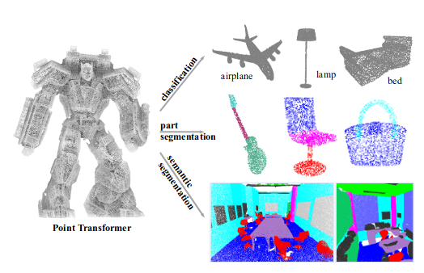

# Point Transformer :

This repository reproduces [Point Transformer](https://arxiv.org/abs/2012.09164) using PaddlePaddle.



### Abstract

Self-attention networks have revolutionized natural language processing and are making impressive strides in image
analysis tasks such as image classification and object detection. Inspired by this success, we investigate the
application of self-attention networks to 3D point cloud processing. We design self-attention layers for point clouds
and use these to construct self-attention networks for tasks such as semantic scene segmentation, object part
segmentation, and object classification. Our Point Transformer design improves upon prior work across domains and tasks.
For example, on the challenging S3DIS dataset for large-scale semantic scene segmentation, the Point Transformer attains
an mIoU of 70.4% on Area 5, outperforming the strongest prior model by 3.3 absolute percentage points and crossing the
70% mIoU threshold for the first time.

### Usage

#### 1. Install PaddlePaddle

#### 2. Install requirements

```bash
pip install -r requirements.txt
```

#### 3. Prepare dataset and Dataloader

This repo currently supports my private dataset only, you can modify the dataloader to fit your own dataset.
You should return a tuple of (point_cloud, label) in your dataloader.
where point_cloud is a numpy array of shape (N, 3), and label is a numpy array of shape (N,).

#### 4 Train

```bash
python train.py
```

[//]: # (#### 5. Eval)

[//]: # ()
[//]: # (```bash)

[//]: # (python eval.py)

[//]: # (```)

### Reference

If you use this code, please cite Point Transformer:

```
@inproceedings{zhao2021point,
  title={Point transformer},
  author={Zhao, Hengshuang and Jiang, Li and Jia, Jiaya and Torr, Philip HS and Koltun, Vladlen},
  booktitle={Proceedings of the IEEE/CVF International Conference on Computer Vision},
  pages={16259--16268},
  year={2021}
}
```

### Links

- [Point Transformer](https://arxiv.org/abs/2012.09164)
- [Original PyTorch Implementation](https://github.com/POSTECH-CVLab/point-transformer)